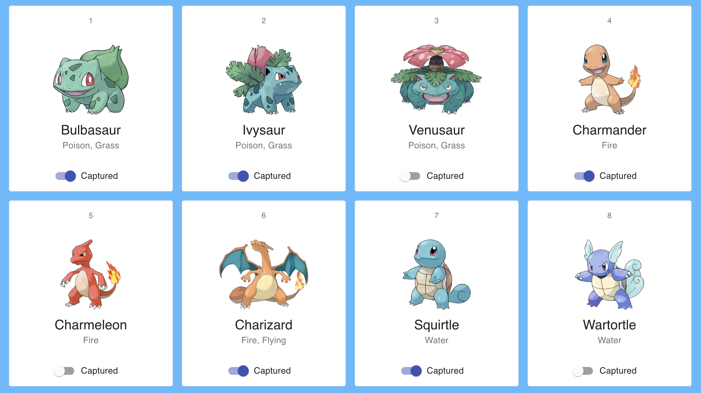

# Workbook 0

This week's Workbook serves as **prepatory work** before the official launch of TAP.

## Workbook Content

The Workbook is divided into 3 parts:

- **Learning How To Learn**

In this section you’ll be exposed to various ideas that will change your view of education and how you learn. Education itself is an ever-evolving science and it’s good for you to know about the latest development in the field so you can learn how to study more effectively.

- **Web Development Fundamentals**

In order to become good at anything you must have a strong foundation. By refreshing the basics you’ll refine your mental model of how software development works in order to make sense of new concepts quicker.

_Both Frontend and Backend is included, but you're only required to do the one that fits with your specialization!_

- **TAP Quickstart**

In order to make the most out of your time in TAP, it's good to look at it from the right perspective. In this section we'll dive into the educational model and mindsets.

## Technical Assignment

In the "Web Development Fundamentals" section of the Workbook you are tasked to build a web application: **an online Pokédex!**. 

It's divided into frontend and backend. You are free to do both, but required to the one that matches your specialization!

The application will contain the following features:

1. View many different Pokémon
2. View their details
3. Record whether or not they’ve captured them.
4. Sarch by name
5. Data should be persistent after refreshing the page.

After you've finished your application, please submit it to this repository through a pull request. Good luck!

_Deadline for part 1 (Frontend): Saturday, Feb 19, 2022 23:59 _
_Deadline for part 2 (Backend):  Saturday, Feb 26, 2022 23:59 _